<div class="corpo" align="center"> 


</div>

## Visão Geral
O aplicativo mobile do **Match Movie** foi desenvolvido utilizando **React Native**, proporcionando uma experiência fluida tanto para Android. Ele consome a API REST do backend para obter informações e recomendações de filmes.

### [Clique aqui para ver o vídeo explicativo](https://youtu.be/dh0EnSvD5Pk?si=vvcsZ87uXuSQr3F2)

## Tecnologias Utilizadas
- **React Native**
- **Expo** (para facilitar o desenvolvimento)
- **React Navigation** (para navegação entre telas)
- **Axios e Fetch** (para comunicação com a API)
- **Context API** (para gerenciamento de estado global)
- **Expo Secure Store** (para armazenamento local de preferências do usuário e chaves de acesso)

## Funcionalidades do App
- **Cadastro/Login** (com autenticação JWT)
- **Busca de Filmes** (integração com a API para pesquisa de títulos)
- **Sistema de Favoritos** (salvar filmes preferidos do usuário)
- **Sistema de Assistidos** (salvar filmes já assistidos do usuário)
- **Criação de grupos** (criação de grupos de usuários)
- **Match** (votação de filmes em grupo)
- **Recomendações Personalizadas** (baseadas em outro filme escolhido pelo usuário)
- **OpenCage API** (calculo de proximidade de usuários do grupo baseado no CEP)
- **Ingresso.com API** (redirecionamento para o site do ingresso.com)

## Consumo da API
O aplicativo faz requisições ao backend utilizando **Axios** e **fetch()**, garantindo comunicação eficiente com a API. Foi construída um API própria que se comunica com APIs externas e banco de dados: [MatchMovie API](https://github.com/jtentis/MatchMovie-API)

## Estrutura de Pastas
```
MatchMovie-Native/
┣ .expo/
┃ ┣ types/
┃ ┃ ┗ router.d.ts
┃ ┣ web/
┃ ┃ ┗ cache/
┃ ┣ devices.json
┃ ┗ README.md
┣ .idea/
┃ ┣ .gitignore
┃ ┣ MatchMovie.iml
┃ ┣ material_theme_project_new.xml
┃ ┣ misc.xml
┃ ┣ modules.xml
┃ ┗ vcs.xml
┣ app/
┃ ┣ (auths)/
┃ ┃ ┣ Login.tsx
┃ ┃ ┣ register.tsx
┃ ┃ ┗ _layout.tsx
┃ ┣ (tabs)/
┃ ┃ ┣ index.tsx
┃ ┃ ┣ match.tsx
┃ ┃ ┣ profile.tsx
┃ ┃ ┗ _layout.tsx
┃ ┣ contexts/
┃ ┃ ┗ AuthContext.tsx
┃ ┣ services/
┃ ┃ ┗ websocket.ts
┃ ┣ +html.tsx
┃ ┣ +not-found.tsx
┃ ┣ details.tsx
┃ ┣ groups.tsx
┃ ┣ history.tsx
┃ ┣ match_voting.tsx
┃ ┗ _layout.tsx
┣ assets/
┃ ┣ fonts/
┃ ┃ ┣ Coiny-Regular.ttf
┃ ┃ ┗ SpaceMono-Regular.ttf
┃ ┗ images/
┃   ┣ group_background.png
┃   ┣ icon.png
┃   ┣ No-Image-Placeholder.png
┃   ┣ no-image.png
┃   ┗ place-holder-movies.png
┣ components/
┃ ┣ navigation/
┃ ┃ ┗ TabBarIcon.tsx
┃ ┣ __tests__/
┃ ┃ ┣ __snapshots__/
┃ ┃ ┗ ThemedText-test.tsx
┃ ┣ AddUserBottomSheet.tsx
┃ ┣ ChangeGroupImageBottomSheet.tsx
┃ ┣ MatchLogo.tsx
┃ ┣ ModalAlert.tsx
┃ ┣ ModalAlertConfirm.tsx
┃ ┣ ModalAlertTiny.tsx
┃ ┣ MovieSelectionBottomSheet.tsx
┃ ┣ SplashScreen.tsx
┃ ┣ ThemedText.tsx
┃ ┗ ThemedView.tsx
┣ constants/
┃ ┣ Colors.ts
┃ ┣ Fonts.ts
┃ ┗ Url.ts
┣ expo-secure-store/
┣ hooks/
┃ ┣ useColorScheme.ts
┃ ┣ useColorScheme.web.ts
┃ ┗ useThemeColor.ts
┣ scripts/
┃ ┗ reset-project.js
┣ .env
┣ .eslintrc.js
┣ .gitignore
┣ app.json
┣ babel.config.js
┣ expo-env.d.ts
┣ package-lock.json
┣ package.json
┣ README.md
┗ tsconfig.json
```

# Telas
<div class="corpo" align="center"> 
<h3>Telas de início</h3>

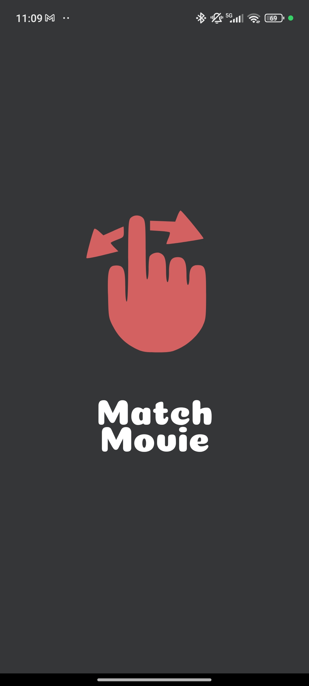
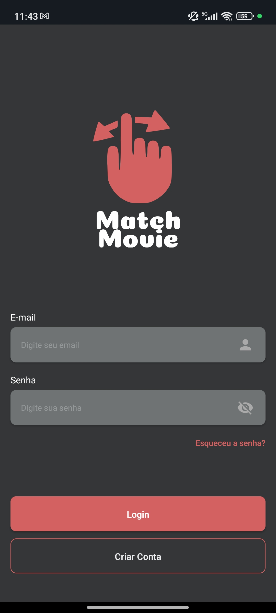
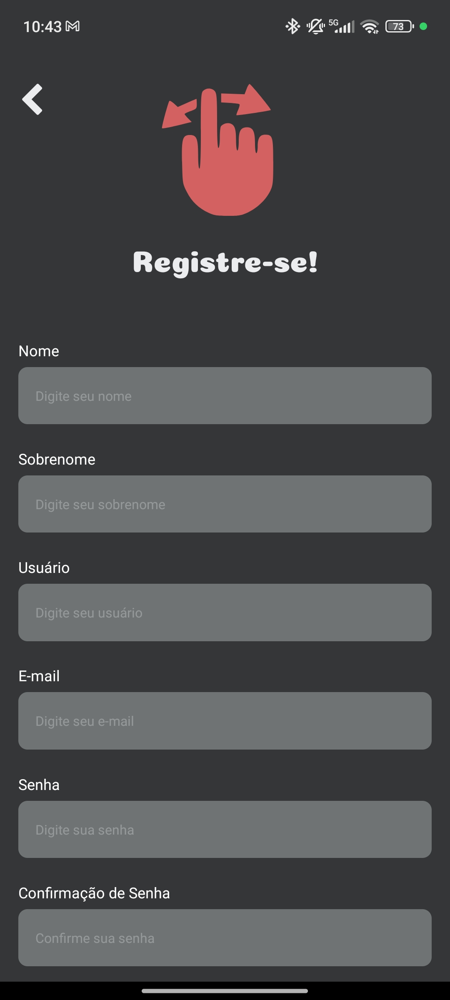

<h3>Telas de recuperação de senha</h3>

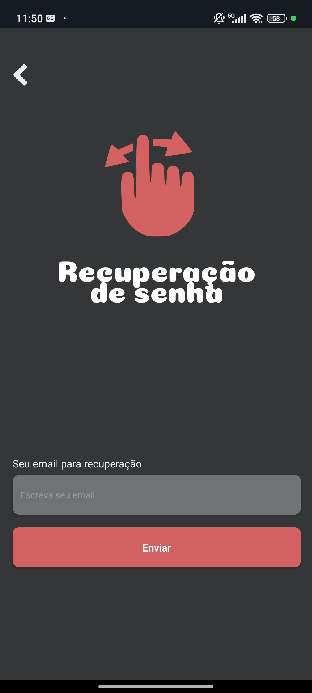
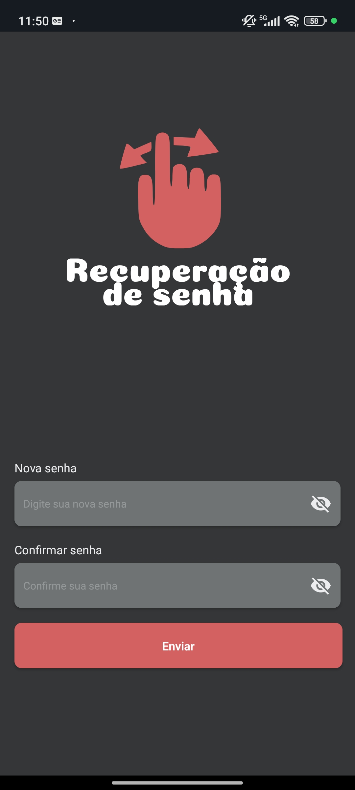

<h3>Telas principais</h3>

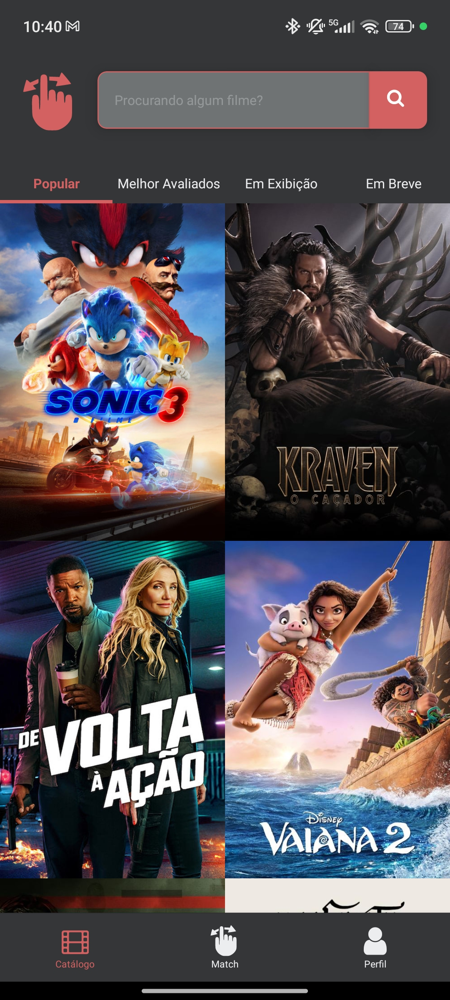
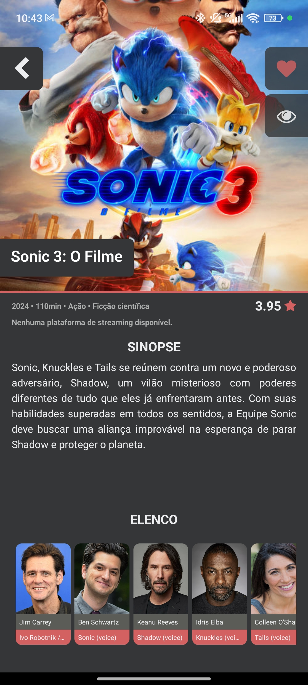
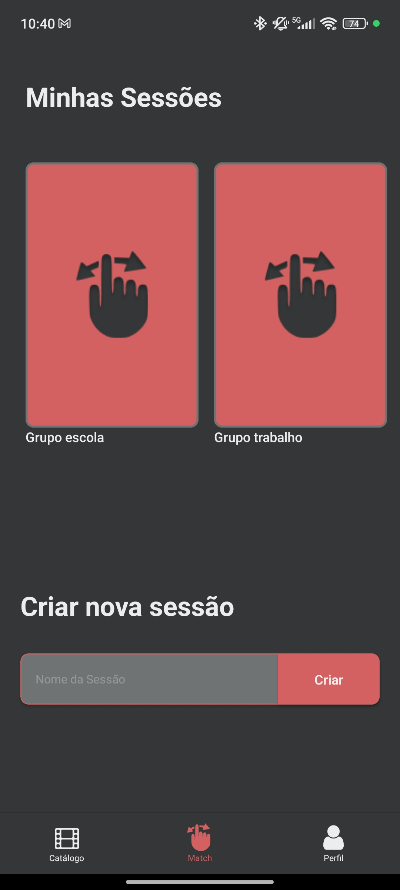
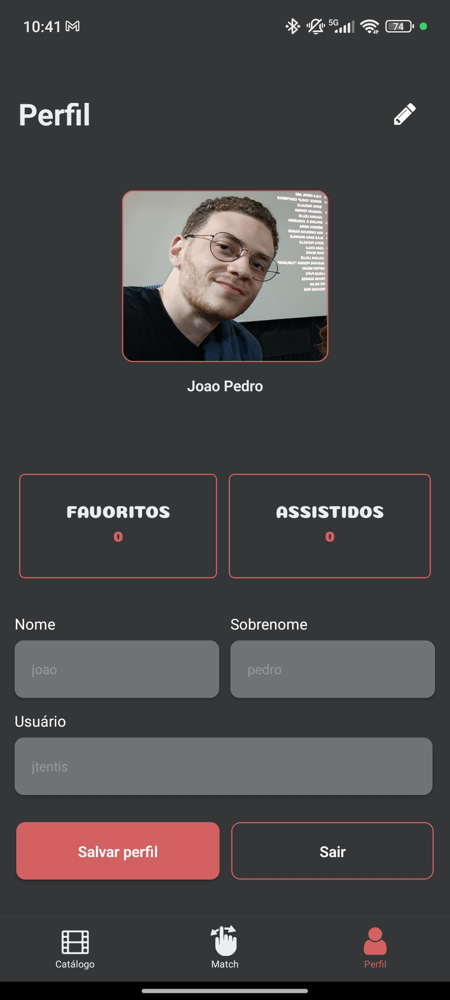
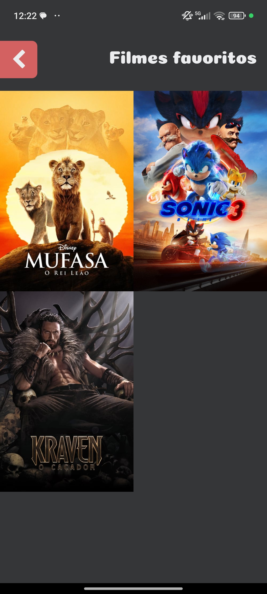
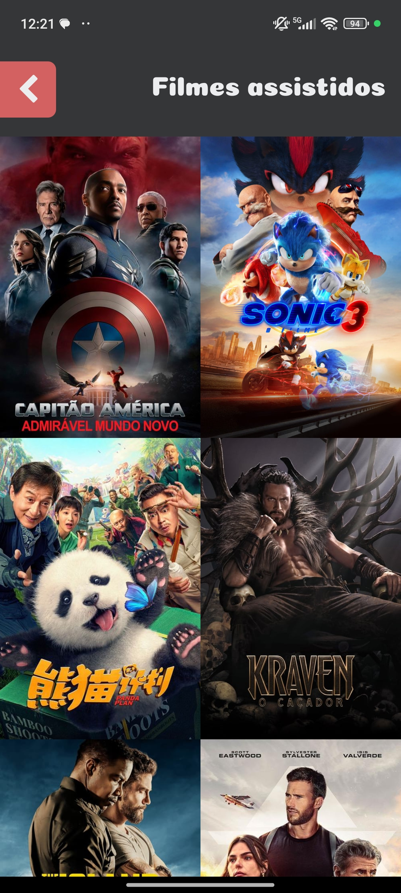

<h3>Telas grupo e modals</h3> 

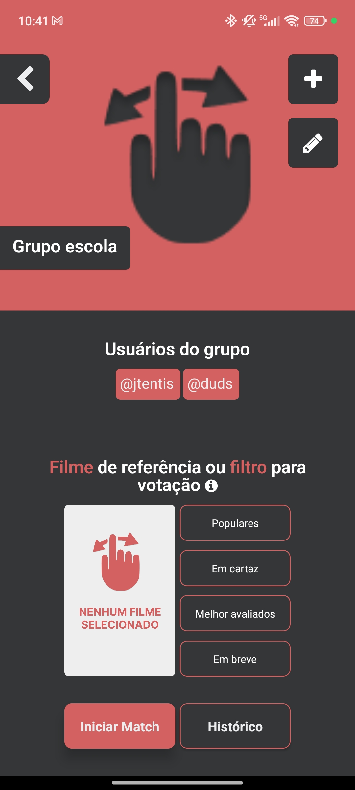
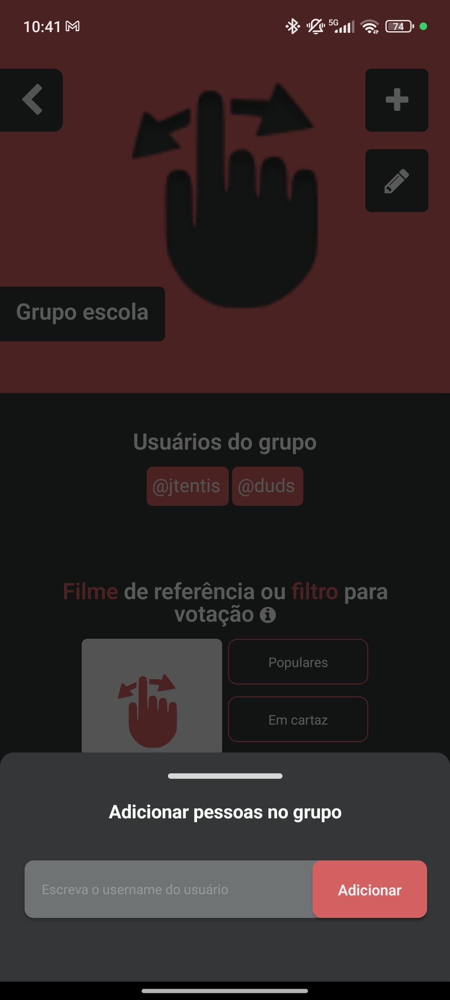
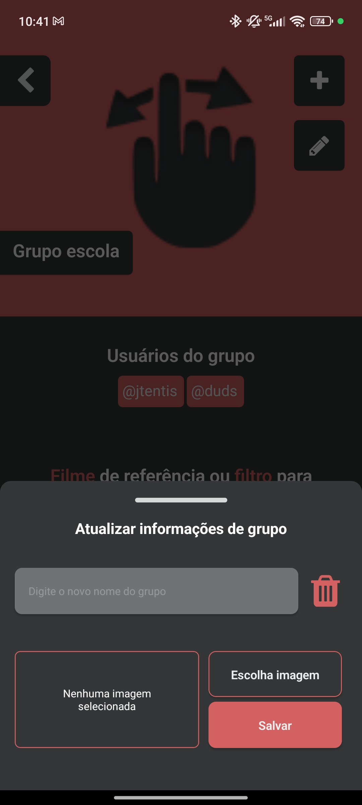
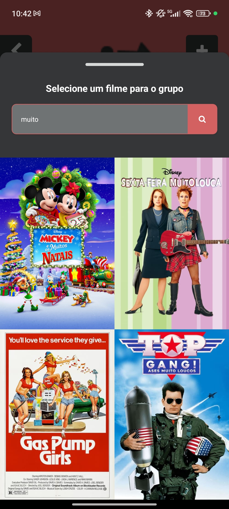
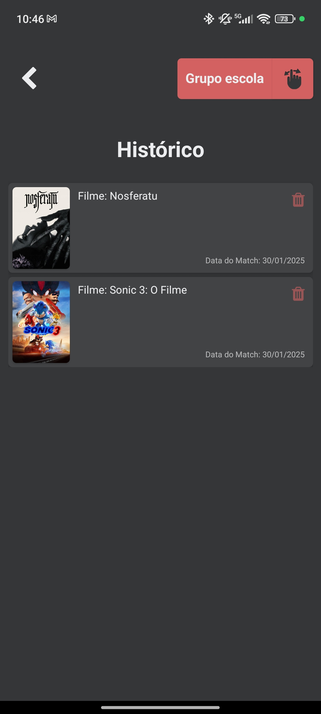

<h3>Telas de votação e match</h3>

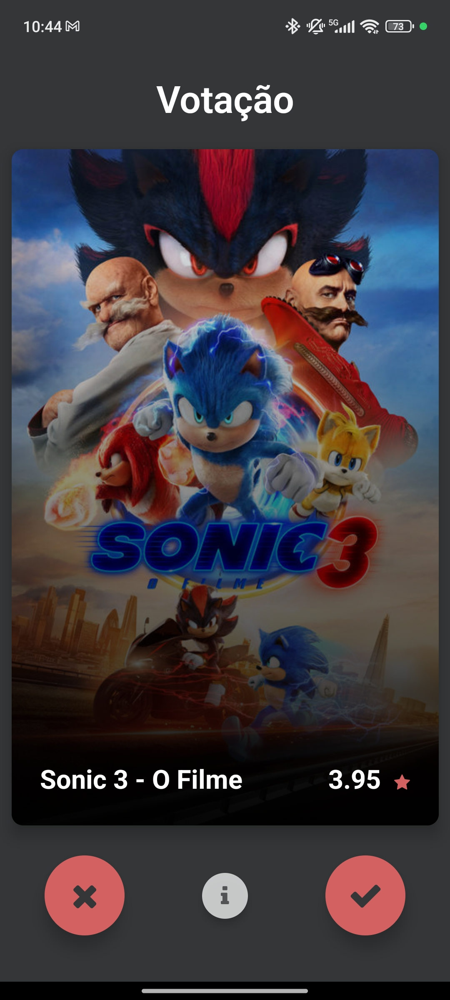
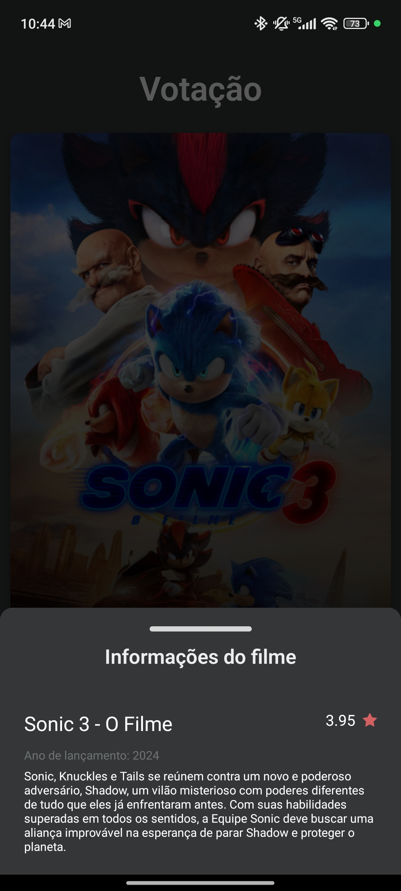
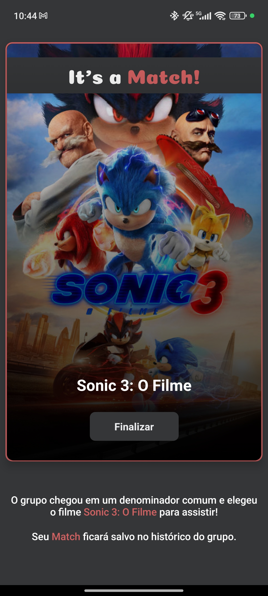
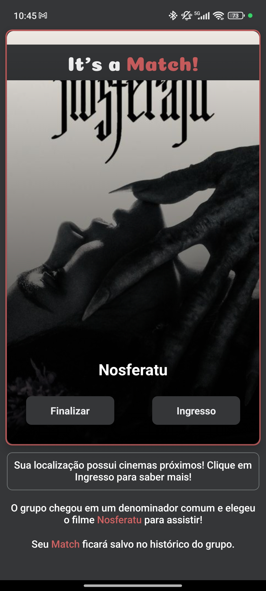

</div>

## Conclusão
O aplicativo **Match Movie** é a solução ideal para grupos de pessoas que querem decidir qual filme irão assistir, marcar seus favoritos e quais já foram assistidos.

## Artigo
Em breve...

